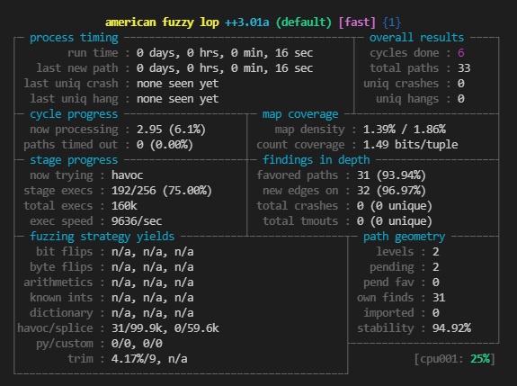

# rust fuzzing

## Setup

### Requirements

### Tools

- C compiler (e.g. gcc or clang)
- make

### Platform

afl.rs works on x86-64 Linux and x86-64 macOS.

`cargo install afl`

### Upgrading

`cargo install --force afl`

### Provide starting inputs

```
mkdir in 
echo "1234567890" > in/input1
echo "abcdef" > in/input2
```

### Build the fuzz target

## example Build rspversion

`cargo afl build`

### Start fuzzing

`cargo afl fuzz -i fuzz-target/in -o fuzz-target/outrspversion target/debug/rspversion`

As soon as you run this command, you should see AFL’s interface start up:



### view coverage 

If you need to check coverage, follow the coverage.md operation, Script rspfuzzrun.sh runs for 1 hour in each case. 
Fuzzcoverage.sh collects info information and generates html files. The html file location is target/debug/coverge.
If you need to run a specific case, please modify the cmd tuple in the script.
Can run at the same time but merge will cause problems

    ```
    sudo apt install screen
    bash rspfuzzrun.sh
    bash fuzzcoverage.sh
    ```

### reference

[Rust Fuzz Book](https://rust-fuzz.github.io/book/afl/setup.html)